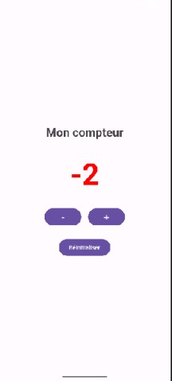

# TP Android Studio – Application compteur

**Nom et prénom :** Basmala Aouida  
**Groupe :** ________  
**Langage :** Kotlin · **Projet :** `CompteurAndroid` · **SDK minimum :** API 24

## Présentation

Application Android qui affiche un compteur modifiable à l'aide de trois boutons. Le travail permet de découvrir la création d'une interface, la gestion des événements de clic et la mise à jour dynamique d'un composant graphique.

| Bouton | Action |
|---|---|
| **+** | augmente la valeur de 1 |
| **-** | diminue la valeur de 1 |
| **Réinitialiser** | remet la valeur à 0 (avec un message Toast) |

Au démarrage, le compteur vaut 0. Il peut devenir négatif.

## Captures d'écran

| Démarrage | Valeur négative | Valeur positive |
|:---:|:---:|:---:|
|  |  |  |
| Compteur à **0** (noir) | Compteur à **-2** (rouge) | Compteur à **2** (vert) |

## Structure du projet

Fichiers principaux demandés :

| Fichier | Rôle |
|---|---|
| `app/src/main/res/layout/activity_main.xml` | Interface : titre, valeur du compteur, trois boutons |
| `app/src/main/java/com/example/compteurandroid/MainActivity.kt` | Logique du compteur et gestion des clics |
| `app/src/main/res/values/strings.xml` | Tous les textes visibles de l'application |

## Fonctionnement

**Interface (`activity_main.xml`).** Les éléments sont centrés dans un `LinearLayout` vertical : le titre « Mon compteur », la valeur en grande taille (72sp) et les boutons, espacés par des marges. Les identifiants sont `textViewCompteur`, `buttonIncrementer`, `buttonDecrementer` et `buttonReinitialiser`.

**Logique (`MainActivity.kt`).**
1. Une variable entière `compteur` est déclarée et initialisée à 0.
2. Les composants sont récupérés avec `findViewById` à partir de leurs identifiants.
3. Chaque bouton a un `setOnClickListener` qui modifie `compteur` (`++`, `--` ou `= 0`).
4. La fonction `actualiserAffichage()` est appelée après chaque modification : elle met à jour le `TextView` pour que la valeur affichée corresponde toujours à la variable.

**Textes (`strings.xml`).** Le titre, les libellés des boutons, la valeur initiale et le message de réinitialisation sont déclarés dans `strings.xml`, et non écrits en dur dans le code.

## Améliorations facultatives réalisées

- **Couleur selon le signe** : vert si la valeur est positive, rouge si elle est négative, noir si elle est nulle.
- **Message Toast** lors de la réinitialisation.
- **Conservation de la valeur après rotation de l'écran** (`onSaveInstanceState`).

## Tests effectués

| Test | Résultat |
|---|---|
| Le compteur affiche 0 au démarrage | ✅ (capture 1) |
| Le bouton + augmente correctement la valeur | ✅ (capture 3 : valeur 2) |
| Le bouton - diminue correctement la valeur | ✅ |
| Le compteur peut afficher une valeur négative | ✅ (capture 2 : valeur -2) |
| Le bouton Réinitialiser remet toujours la valeur à 0 | ⬜ |

L'application ne se ferme pas lors de l'utilisation des boutons.

## Difficultés rencontrées

- **Lancer l'application** : l'entrée *Device Manager* n'était plus dans le menu *Tools* de la version récente d'Android Studio. Il a fallu la retrouver via *View → Tool Windows → Device Manager* pour créer l'appareil virtuel.
- **Envoi sur GitHub** : lors du `git add .`, Git a affiché des avertissements sur la conversion des fins de ligne (LF vers CRLF). Ce sont de simples avertissements sous Windows, sans effet sur le projet.

## Lancer le projet

1. Ouvrir le dossier du projet dans Android Studio et attendre la synchronisation Gradle.
2. Sélectionner un émulateur ou un téléphone Android dans la liste des appareils.
3. Cliquer sur **Run ▶** (`Shift + F10`).